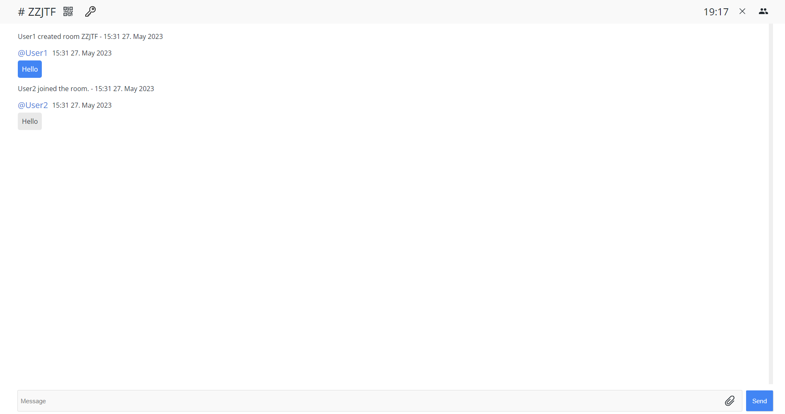

<!-- Logo -->

  

---

# SafeShare

A web chat app

## Functionality

With this application you can create temporary encrypted chatrooms to share texts and files.

There are two room types. You can choose between an open and a password secured (and encrypted) room.

When creating a room it's code is automatically generated. This code can then be shared and used to join the room from another device.

Rooms are only temporary. They (and their data) will be removed after 20 minutes.

Here is a screenshot of the browser:

## Technologies

This app is based on a [Flask](https://flask.palletsprojects.com/) webserver and uses WebSockets ([SocketIO](https://socket.io/)) for realtime messages. It uses an SQLite database to store data.

## How the encryption process works

A room secured with a password is created

- when creating or joining a room it's password is stored in LocalStorage on the client.
- Serverside the passwords are stored as a hash

1. User1 sends a message from his frontend to the server. Before sending the message it is encrypted on the client with AES using the room's password as an encryption key.

2. The server then stores the encrypted message and sends it to all other users in the room.

3. User2 receives the message and decrypts it using the (same) room password as an decryption key.

## Development

You can host this application yourself. Make sure to install all packages listed in requirements.txt

- create a `.env` file in the same dir as `main.py` to specify

        REMOVE_ROOMS=True # 'FALSE' or 'TRUE'
        REMOVE_ROOMS_AFTER=20 # in minutes
        MAX_BUFFER_SIZE=50000000 # 50 MB
        ENCRYPTED_MAX_UPLOAD=8 # in mb
        MAX_UPLOAD=50 # in mb
        HOST=192.168.178.57 # IPv4

- Then run in `Server`

        python main.py

## Bugs / Issues

- application crashes when trying to encrypt and send files over 10mb
